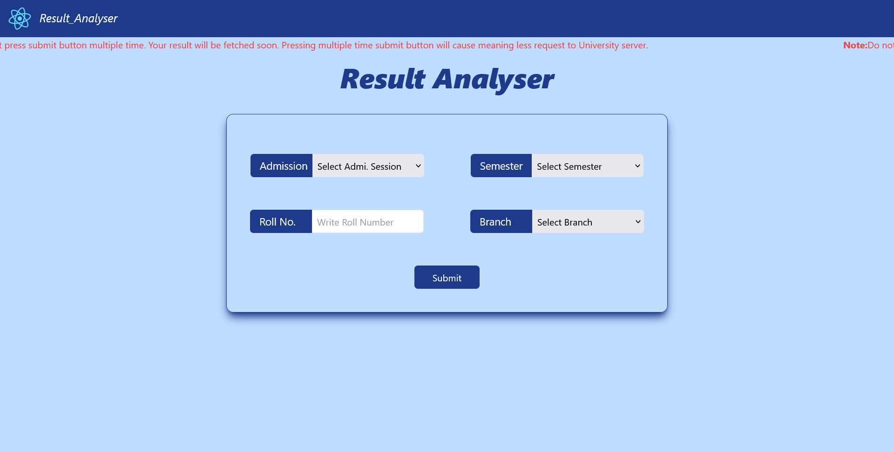
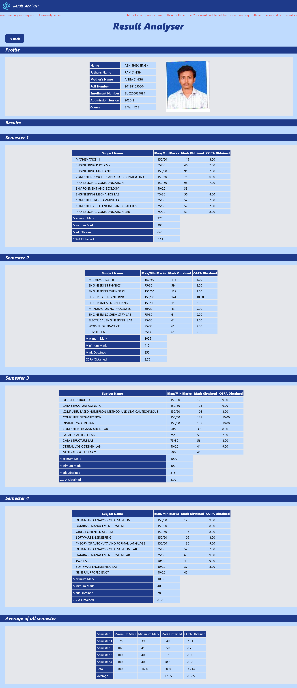

# Result Analyser
Result Analyser, a web scraping tool that can fetch and display results from my university website.
Frontend of Result Analyser is created using React js and backend with Python. I used Selenium and BeautifulSoup to scrape the data and process it. The tool can show each semester's result and calculate the average of each semester for any student.
If you want to see how Result Analyser works, check out the demo video here: [Click to view demo vedio](https://youtu.be/T4dDA5mbNfM) .

## Table of Contents
- [Result Analyser](#result-analyser)
- [Table of Contents](#table-of-contents)
- [Installation](#installation)
- [How to run Result Analyser](#how-to-run-result-analyser)
  - [Requirements](#requirements)
  - [Scripts](#scripts)
- [Screenshots of Result Analyser](#screenshots-of-result-analyser)
  - [Home page of Result Analyser](#home-page-of-result-analyser)
  - [My result data fetched and displayed using result analyser](#my-result-data-fetched-and-displayed-using-result-analyser)
- [Technology Stack](#technology-stacks)

## Installation

- Fork this repository
- To clone repository in your local system,  open your terminal and run below command 

    ```
    $ git clone https://github.com/your-user-id/result-analyser.git
    ```

## How to run Result Analyser

- ### Requirements
  - Python should be installed  in your system
  - Node  should be installed in your system
- ### Scripts
  - To start backend run below command 

    ```
    $ python api.py
    ```
  - To start frontend run below command 
    ```
    $ npm run start
    ```
  - Creating build file <br/>
    Builds the app for production to the build folder.<br/>
    It correctly bundles React in production mode and optimizes the build for the best performance.
    The build is minified and the filenames include the hashes.<br/>
    Your app is ready to be deployed! 
     
    ```
    $ npm run start
    ```

## Screenshots of Result Analyser

- ### Home page of Result Analyser

  
- ### My result data fetched and displayed using result analyser

  

## Technology Stacks

           